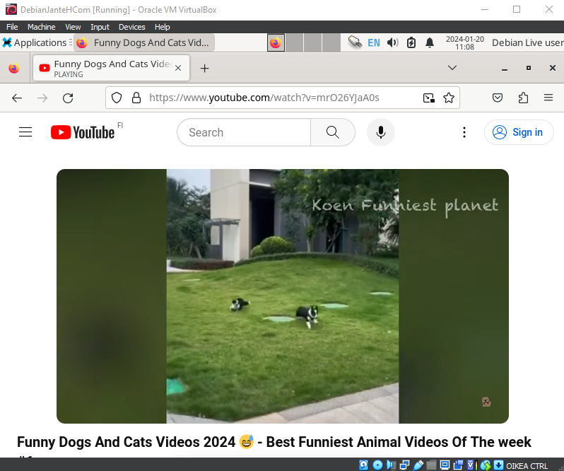

# Oma Linux

## Tiivistelmä artikkelista "What is Free Software?"

- Ilmaisella sovelluksella tarkoitetaan kaikkien käytössä olevaa sovellusta
- Sovellus on kopioitavissa, ja sitä saa muokata ja muovata oman mielen mukaan
- Ilmainen sovellus on eri asia kuin vapaan lähdekoodin sovellus
- Artikkelin mukaan ilmaisella sovelluksella on neljä olennaista vapautta
    1. Vapaus suorittaa ohjelmaa kuten haluaa
    2. Pääsy lähdekoodiin, ja oikeus muokata sitä
    3. Vapaus jakaa kopioita auttaakseen muita
    4. Vapaus jakaa muokattua versiota edellyttäen myös lähdekoodin jakamista

  ###### Lähteet

  GNU Operating System. What is Free Software? Luettavissa: https://www.gnu.org/philosophy/free-sw.html Luettu: 20.01.2024.

## Linuxin asentaminen virtuaalikoneeseen

Tehtävässä on käytetty Debian Linuxia, ja asennettu se VirtualBoxiin.

Fyysinen rauta, jolle asennus on tehty:

- OS Microsoft Windows 10 Home
- Version 10.0.19045 Build 19045
- System type x64-based PC
- Processor AMD Ryzen 5 1600X Six-Core Processor, 3600 Mhz, 6 Core(s), 12 Logical Processor(s)
- BIOS Version/Date	American Megatrends Inc. 2.NS, 01/11/2021
- BaseBoard Manufacturer MSI
- BaseBoard Product	B350M GAMING PRO (MS-7A39)
- Installed Physical Memory (RAM) 16,0 GB
- GPU NVIDIA GeForce RTX 2070 SUPER (Manufacturer MSI)

Latasin Debian ISO imagen netistä. Tässä asennuksessa käytin versiota 12.4.0 xfce-työpöytäympäristöä. Latasin myös Oraclen VirtualBoxin ja asensin sen tietokoneelleni.

#### Virtuaalikoneen luominen VirtualBoxiin

Käynnistin VirtualBoxin sovelluksen latauksen jälkeen, ja valitsin ikkunasta "New"

  
Nimesin virtuaalikoneen, valitsin ladatun ISO imagen, tyypiksi Linux, versio Debian 64-bit. Ja ruksi ruutuun skip unattanded installation.

Lisäsin RAM muistia, muutaman prosessorin lisää, ja loin kovalevyn.

#### Virtuaalikoneen käynnistys

Kohtasin tässä ongelmaan, ettei virtuaalikoneeni käynnisty. Sain virheeksi AMD-V is disabled in the BIOS (or by the host OS) (VERR_SVM_DISABLED).

Googletin ongelmaa, ja kokeilin luoda Virtuaalikoneen uudelleen vain yhdellä prosessorilla.  
Tämä ei kuitenkaan auttanut, joten päätin bootata koneeni BIOS:iin ja tutkia sieltä, pystynkö enabloimaan prosessorin asetuksista Secure Virtual Machine Moden

Löysin BIOS asetuksista SVM (Secure Virtual Machine Mode) asetuksen, jonka nyt sallin.  
Tämä auttoi, ja sain virtuaalikoneen käyntiin.

Käynnistin Debianin Live system (amd64).

Käynnistyksessä painoin esc -näppäintä, niin sain näkymän prosessista. Hetken kuluttua työpöytä avautui näkyviin.

Testasin asennusta toimivaksi käynnistämällä verkkoselaimen.

Havaittu, että kaikki toimii (hiiri, näppäimistö, netti ja näyttö)

#### Asennus

Klikkasin työpöydältä Install Debian -kuvaketta. Ilmoitukseen Launch Anyway.

Kieleksi englanti, lokaatioksi Helsinki, näppäimistö finnish.

Partitions; Erase disk ilman kryptausta, Boot loader Master Boot...

Käyttäjätietoihin nimi, käyttäjänimi, koneen nimi ja salasana.

Summaryn tarkistus ja install. Asennuksen odottelu.

"All done." "Restart now" - Yes. Click "Done."

#### Kirjautuminen virtuaalikoneelle

Kirjautuminen sisään määritellyillä tunnuksilla.

Testataan järjestlemää taas toimivaksi avaamalla selaimesta youtube, ja pyöräyttämällä muutama kissavideo.

#### Ensimmäinen vaihe

Päivitetään järjestelmä terminaalin kautta.

    sudo apt-get update

Tunnuksen salasanan kirjoitus ja katsellaan kun paketit valuu sisään.

Asennetaan haetut paketit.

    sudo apt-get -y dist-upgrade

Odotellaan asennus.

Asennetaan palomuuri ja sen aktivointi.

    sudo apt-get -y -install ufw
    sudo ufw enable

Uudelleen käynnistys, ja sisään kirjautuminen.

#### Guest additions

Asennetaan VirtualBox Guest Additions, jotta saadaan näyttöä suurennettua.

Valitaan ylärivistä Devices, Insert Guest Additions CD image...  
Avataan File Manager ja valitaan lisätty levy näkyviin, jotta nähdään tiedoston polku.

Avataan terminaali, mennään kansioon ajamaan VBoxLinuxAdditions.run

    cd /media/*/VBox*

Tällä komennolla pääsemme oikeaan kansioon ja seuraavalla komennolla näemme listan kansiossa olevista tiedostoista

    ls

Seuraavaksi ajetaan sudona .run päätteinen tiedosto.

    sudo bash VBoxLinuxAdditions.run

Odotellaan asennus, ja bootataan järjestelmä

    sudo reboot

Kirjaudutaan sisään, ja kokeillaan suurentaa ikkunaa.

Hurraa! Se toimii!

###### Lähteet

Terokarvinen.com. Install Debian on Virtualbox - Updated 2023. Luettavissa: https://terokarvinen.com/2021/install-debian-on-virtualbox/?fromSearch=virtual%20box Luettu: 20.01.2024.

Appuals.com. Fix: AMD-V is disabled in the BIOS (VERR_SVM_DISABLED). Luettavissa: https://appuals.com/fix-amd-v-is-disabled-in-the-bios-verr_svm_disabled/ Luettu: 20.01.2024.
