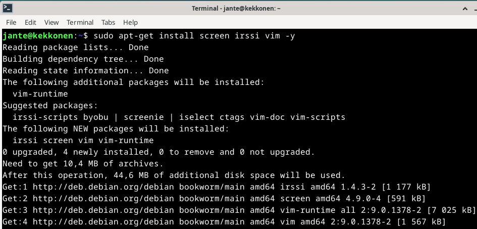
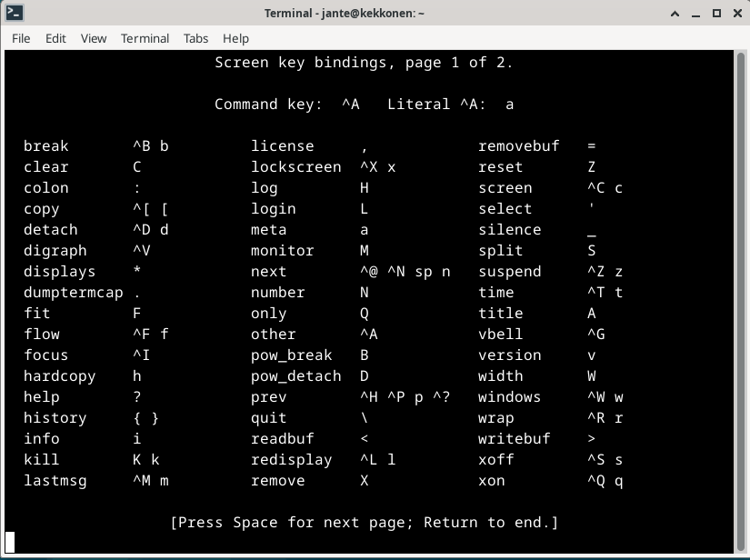
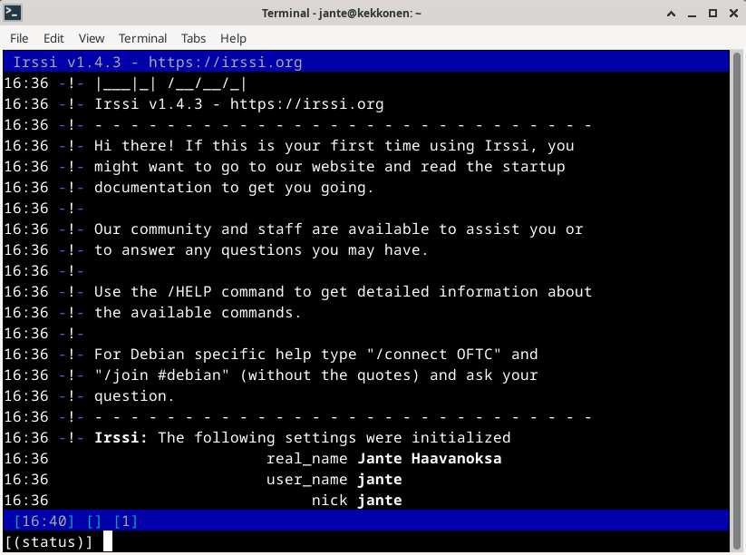
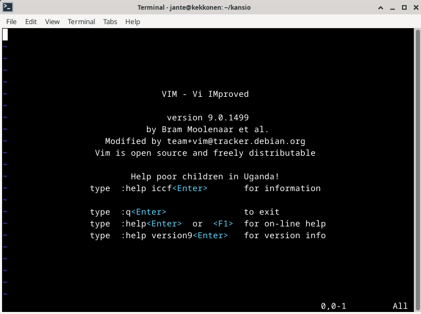

## Command line basics

- Liikkuminen kirjastossa
  - 'pwd' tulostaa kirjaston, jossa ollaan
  - 'ls' listaa tiedostot ja kansiot, jossa ollaan
  - 'cd' eli change directory. Voidaan käyttää eri tavoin kansiossa liikkumiseen 'cd ..' tai 'cd xyz/'
- 'less xyz.txt' näyttää tekstitiedoston (välilyönti ja "b" sivujen kelaus, "/" hakutoiminto, "q" lopetus)
- 'nano xyz.txt' avaa muokkaustilan tekstitiedostolle ohjelmassa nano
- 'mkdir xyz' tekee uuden kansion nimeltä xyz
- 'mv' komennolla voi liikutella tai nimetä tiedostoja uudelleen
  - 'mv vanhanimi uusinimi'
  - 'mv tiedosto uusisijainti/'
- 'cp' -komennolla voidaan kopioida tiedostoja tai kansioita
- 'rmdir tyhjäkansio' poistaa kansion, joka on tyhjä
- 'rm' komennolla voidaan poistaa tiedostoja ja parametrilla '-r' kansioita

## Micro-editorin asennus

- Avataan komentokehote ja asennetaan Micro -editori sovellus komennolla

      sudo apt-get -y install micro

## Raudan testaus

-
-

## Apt. Ohjelmien asennus

Ohjelmien asennus apt-get -komennolla

Jos halutaan asentaa monta ohjelmaa, voi ne laittaa komentoon peräkkäin. Esimerkiksi tässä asennetaan ohjelmat screen, irssi ja vim

    sudo apt-get install screen irssi vim -y

#### screen

Screenillä pystyy käynnistämään ja käyttämään useita shell-istuntoja yhdestä ssh-istunnosta. Käytännössä screeniin saa esimerkiksi irssin tai vaikka Minecraft serverin pyörimään taustalle.

Komennolla 'screen' saa ohjelman käyntiin. Näppäimillä ctrl+a ja ? näkee esimerkiksi eri näppäimien toiminnot.

#### irssi

Modulaarinen tekstitilan chat ohjelma.

Chat kanaville voi esimerkiksi liittyä komennolla: /j kanavannimi

#### vim

Tekstieditointi ohjelma.

Vimissä tekstiä editoidaan komennolla 'i'  
Editointi tilasta pääsee "esc" -näppäimellä pois  
Tallennus tapahtuu komennolla ':w'  
Ja lopetus komennolla ':q'  

## FHS. Kansiot

-
-

## Grep komento

-
-

## Pipe komento

-
-

## Tukki

-
-

###### Lähteet

freeCodeCamp.org https://www.freecodecamp.org/news/vim-beginners-guide/

Irssi.org https://irssi.org/New-users/ 

Linuxize.com https://linuxize.com/post/how-to-use-linux-screen/ 

Terokarvinen.com. https://terokarvinen.com/2020/command-line-basics-revisited/ 

Terokarvinen.com. https://terokarvinen.com/2024/linux-palvelimet-2024-alkukevat/ 

