## Command line basics

- Liikkuminen kirjastossa
  - 'pwd' tulostaa kirjaston, jossa ollaan
  - 'ls' listaa tiedostot ja kansiot, jossa ollaan
  - 'cd' eli change directory. Voidaan käyttää eri tavoin kansiossa liikkumiseen 'cd ..' tai 'cd xyz/'
- 'less xyz.txt' näyttää tekstitiedoston (välilyönti ja "b" sivujen kelaus, "/" hakutoiminto, "q" lopetus)
- 'nano xyz.txt' avaa muokkaustilan tekstitiedostolle ohjelmassa nano
- 'mkdir xyz' tekee uuden kansion nimeltä xyz
- 'mv' komennolla voi liikutella tai nimetä tiedostoja uudelleen
  - 'mv vanhanimi uusinimi'
  - 'mv tiedosto uusisijainti/'
- 'cp' -komennolla voidaan kopioida tiedostoja tai kansioita
- 'rmdir tyhjäkansio' poistaa kansion, joka on tyhjä
- 'rm' komennolla voidaan poistaa tiedostoja ja parametrilla '-r' kansioita

## Micro-editorin asennus

- Avataan komentokehote ja asennetaan Micro -editori sovellus komennolla

      sudo apt-get -y install micro

## Raudan testaus

Asennetaan lshw

    sudo apt-get install lshw -y

Listataan koneen rauta komennolla

    sudo lshw -short -sanitize

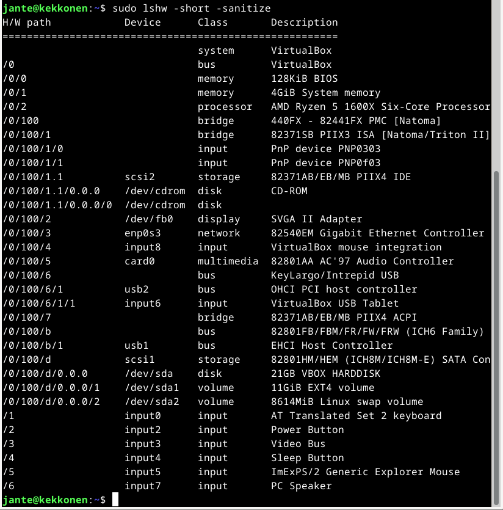

Kuvassa H/W path on polku, jota voisi ajatella emolevyn "slotteina", jossa laite on kiinni. Voi olla myös integroitu "slotti". Numero kertoo "slotin" ja "lanen" eli mihin kyseinen laite on kytketty.

Device sarake kertoo laitteen loogisen tyypin. Ja Class -sarake luokan. Description kentässä lyhyt selitys ko. laittelle.

## Apt. Ohjelmien asennus

Ohjelmien asennus apt-get -komennolla

Jos halutaan asentaa monta ohjelmaa, voi ne laittaa komentoon peräkkäin. Esimerkiksi tässä asennetaan ohjelmat screen, irssi ja vim

    sudo apt-get install screen irssi vim -y

#### screen

Screenillä pystyy käynnistämään ja käyttämään useita shell-istuntoja yhdestä ssh-istunnosta. Käytännössä screeniin saa esimerkiksi irssin tai vaikka Minecraft serverin pyörimään taustalle.

Komennolla 'screen' saa ohjelman käyntiin. Näppäimillä ctrl+a ja ? näkee esimerkiksi eri näppäimien toiminnot.

#### irssi

Modulaarinen tekstitilan chat ohjelma.

Chat kanaville voi esimerkiksi liittyä komennolla: /j kanavannimi

#### vim

Tekstieditointi ohjelma.

Vimissä tekstiä editoidaan komennolla 'i'  
Editointi tilasta pääsee "esc" -näppäimellä pois  
Tallennus tapahtuu komennolla ':w'  
Ja lopetus komennolla ':q'  

## FHS - Filesystem Hierarchy Standard

#### /

Root -kansio. Kaikki muut on tämän kansion alla.

Avataan komentokehote. 'pwd' -komento näyttää, että olemme käyttäjän kotikansiossa.

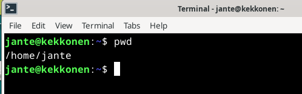

Komennolla 'cd /' pääsemme suoraan "root" hakemistoon. 'pwd':llä vielä tarkistus.

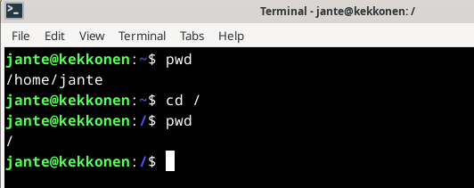

#### /home/

Kotihakemisto kaikkien käyttäjien kotihakemistoille.

'pwd':llä nähdään taas, että olemme käyttäjän kotihakemistossa. Mennään yksi hakemisto ylemmäksi komennolla 'cd ..'

Nyt olemme niin sanotusti kotien kotihakemistossa. Katsotaan vielä 'ls' -komennolla, että tässä kansiossa on käyttäjät. Tässä tapauksessa käyttäjiä on vain yksi.

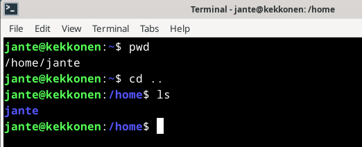

#### /home/jante/

Käyttäjän kotihakemisto. Ainoa sijainti, johon kyseinen käyttäjä pystyy tallentamaan dataa pysyvästi.

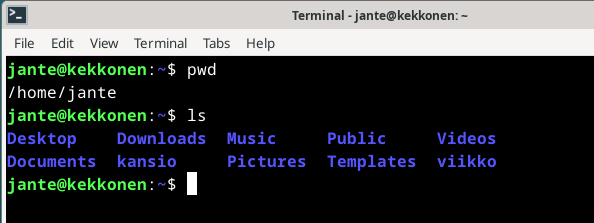

#### /etc/

Sisältää järjestelmän asetustiedostot lukukelpoisina tekstitiedostoina.

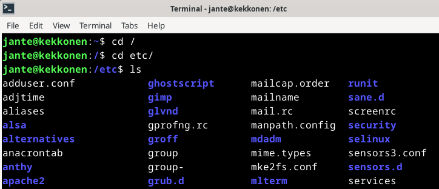

#### /media/

Root hakemiston alla. Näyttää koneeseen kytketyt "mediat" kuten USB-tikut tai CD-levyt

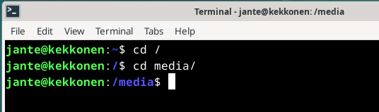

#### /var/log/

Sisältää järjestelmänlaajuiset lokit.

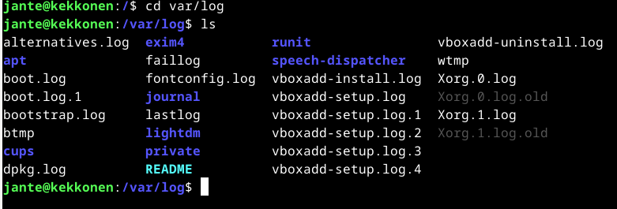

## Grep komento

Grep komennolla voi etsiä ehtoihin määriteltyjä asioita tiedostosta.

Esimerkiksi komennolla:

    grep -w "cat" --color catipsum.txt

Voimme etsiä kaikki rivit, joissa "cat" sana tiedostosta catipsum.txt ja värittää ne. '-w' parametri määrittää, että ainoastaan "cat" -sana lasketaan mukaan. Eikä esimerkiksi "cats" tai "catch".

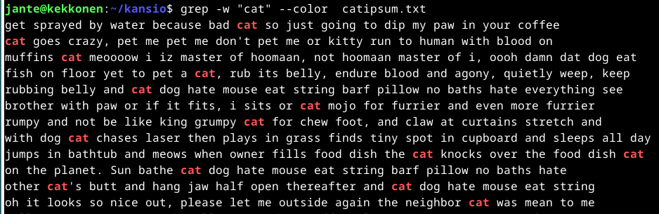

Toinen esimerkki komennolla:

    grep -c "cat" catipsum.txt

Tässä lasketaan vastaava merkkijono, kuinka monta kertaa se toistuu tiedostossa.

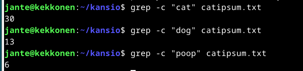

Kolmas esimerkki. Voimme etsiä monesta eri tiedostosta komennolla:

    grep -l "cat" *

Tämä näyttää, missä tiedostoissa on haettu sana.

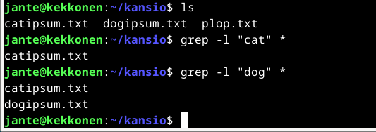

## Pipe komento '|'

Putkikomennon ensisijainen tarkoitus on yhdistää yhden komennon tuloste suoraan toisen komennon syötteeseen.

Esimerkiksi näin:

    komento1 | komento2

Komento1 on ensimmäinen komento, jonka tuloste toimii seuraavan komennon syötteenä.

Käytännössä komento voisi mennä näin:

    ls -l | grep '.txt'

Komento listaa kansiossa olevat tekstitiedostot.

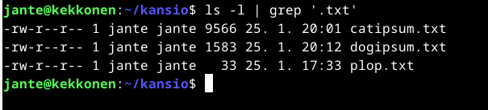

Tai komento, joka näyttää listan asennetuista ohjelmista

    history | grep apt

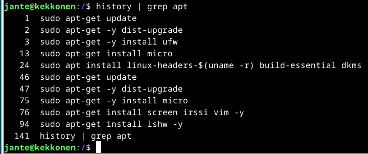

## Logit

Avataan komentokehote, ja suoritetaan komento, jotta saadaan näkyviin reaaliaikaiset logit

    sudo journalctl -f

Esimerkki, miltä salasanan väärin kirjoittaminen näyttäisi logista. Avataan toinen komentokehote viereen, ja kokeillaan kirjautua pääkäyttäjäksi ensin virheellisellä salasanalla, jonka jälkeen oikealla salasanalla.

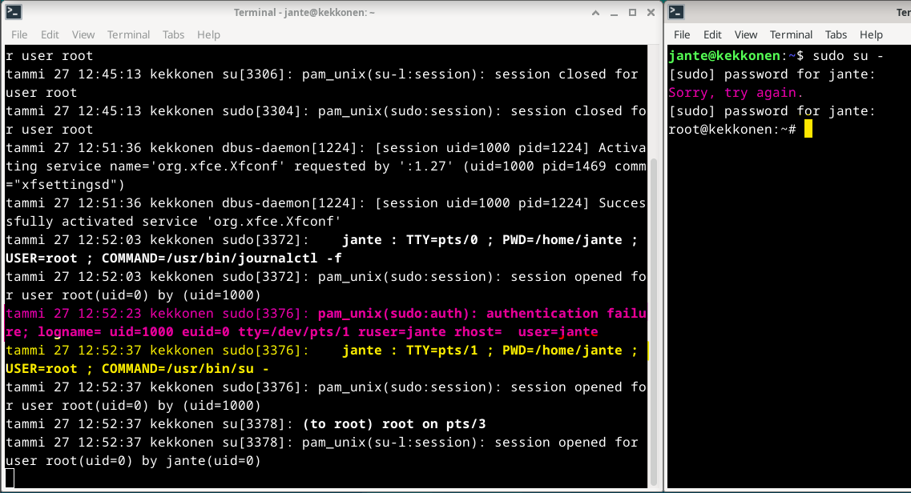

Kuvassa näkyy punaisella korostettuna virheellinen autentikointi, ja keltaisella onnistunut autentikointi.

###### Lähteet

FreeCodeCamp.org. How to Use Vim – Tutorial for Beginners. Luettavissa: https://www.freecodecamp.org/news/vim-beginners-guide/ Luettu: 27.01.2024.

FreeCodeCamp.org. Grep Command in Linux – Usage, Options, and Syntax Examples. Luettavissa: https://www.freecodecamp.org/news/grep-command-in-linux-usage-options-and-syntax-examples/ Luettu: 27.01.2024.

Irssi.org. New users guide. Luettavissa: https://irssi.org/New-users/ Luettu: 27.01.2024.

Linux.com. Deep Hardware Discovery With lshw and lsusb on Linux. Luettavissa: https://www.linux.com/training-tutorials/deep-hardware-discovery-lshw-and-lsusb-linux/ Luettu: 27.01.2024.

Linuxize.com. How To Use Linux Screen. Luettavissa: https://linuxize.com/post/how-to-use-linux-screen/ Luettu: 27.01.2024.

Man(7).org. Grep(1) - Linux manual page. Luettavissa: https://man7.org/linux/man-pages/man1/grep.1.html#EXAMPLE Luettu: 27.01.2024.

Scaler.com. Pipe Command in Linux. Luettavissa: https://www.scaler.com/topics/pipe-command-in-linux/ Luettu: 27.01.2024.

TechAdmin.net. Understanding the Difference Between ‘sudo su -‘ and ‘sudo -i’. Luettavissa: https://tecadmin.net/understanding-the-difference-between-sudo-su-dash-and-sudo-i/ Luettu 27.01.2024.

Terokarvinen.com. Command Line Basics Revisited. Luettavissa: https://terokarvinen.com/2020/command-line-basics-revisited/ Luettu: 27.01.2024.

Terokarvinen.com. Linux Palvelimet 2024 alkukevät. Luettavissa: https://terokarvinen.com/2024/linux-palvelimet-2024-alkukevat/ Luettu: 27.01.2024.
