## Name-based Virtual Host Support

- IP-pohjaiset virtuaaliset hostit käyttävät IP-osoitetta oikean virtuaalisen hostin määrittämiseen; Tällöin on oltava jokaiselle hostille oma IP osoite.
- Nimipohjaisessa virtuaalihostauksessa palvelin luottaa siihen, että asiakas ilmoittaa hostnamen osana HTTP-otsikkoa; Tätä tekniikkaa käyttämällä monet eri hostit voivat jakaa saman IP-osoitteen.
- DNS palvelinta käytetään yhdistämään hostname oikeaan IP-osoitteeseen

###### Lähde

Name-based Virtual Host Support. Apache.org. Luettavissa: https://httpd.apache.org/docs/2.4/vhosts/name-based.html Luettu: 30.1.2024.

## Name Based Virtual Hosts on Apache – Multiple Websites to Single IP Address

- Apachella voi olla useita verkkotunnuksia yhdessä IP-osoitteessa.
- Sivustoja voi lisätä tekemällä uuden nimipohjaisen virtual hostin.

###### Lähde

Name Based Virtual Hosts on Apache – Multiple Websites to Single IP Address. Terokarvinen.com. Luettavissa: https://terokarvinen.com/2018/04/10/name-based-virtual-hosts-on-apache-multiple-websites-to-single-ip-address/ Luettu: 30.1.2024.

# Apache

## Apachen asennus

    sudo apt-get install apache2

Testaus:

    firefox "http://localhost" 

## Lokien analysointi

Logit löytyvät /var/log/apache2

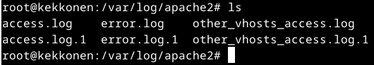

Logeja voi tarkastella komennolla:

    tail /var/log/apache2/error.log

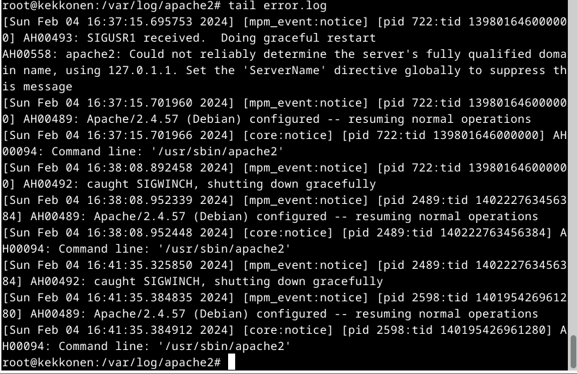

## Etusivu uusiksi

Luodaan uusi etusivu localhostille.

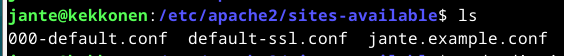

Ensin uusi konffi tiedosto hattu.example.conf lisätään sites-availablen alle.

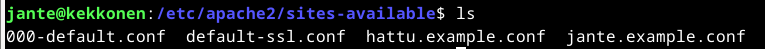

Lisätään konffitiedostoon tarvittavat tiedot:

    sudoedit hattu.example.conf

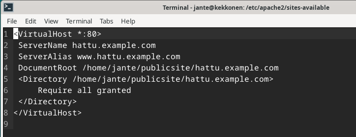

Sitten lisätään kotihakemistoon määritelty paikka, johon index.html

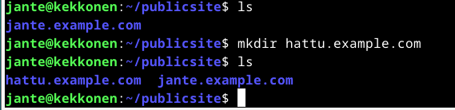

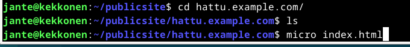

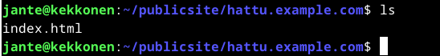

Sitten disabloidaan vanha sivu:

    sudo a2dissite jante.example.conf

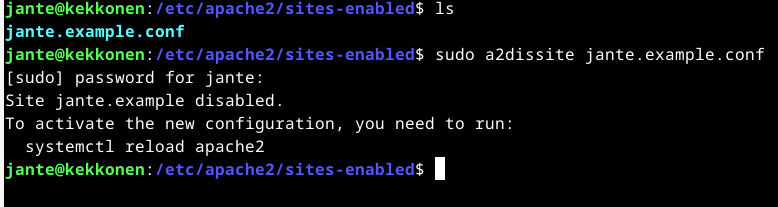

Apachen uudelleen käynnistys:

    sudo systemctl restart apache2

Ja enabloidaan uusi sivu:

    sudo a2ensite hattu.example.conf

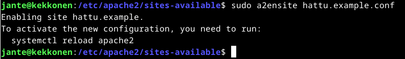

ja apachen uudelleen käynnistys

    sudo systemctl restart apache2

## HTML5 -sivu

Muokataan sivusta validi HTML sivu ja tarkisteaan se validatorilla (https://validator.w3.org/)

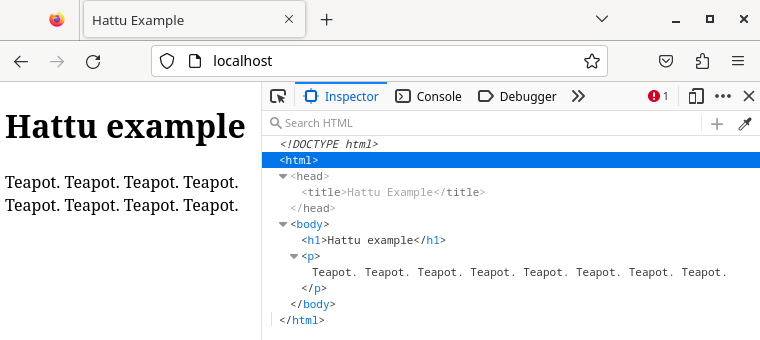

Validator huomautti kielen määrityksestä, joten lisäsin tämän vielä html tagiin.

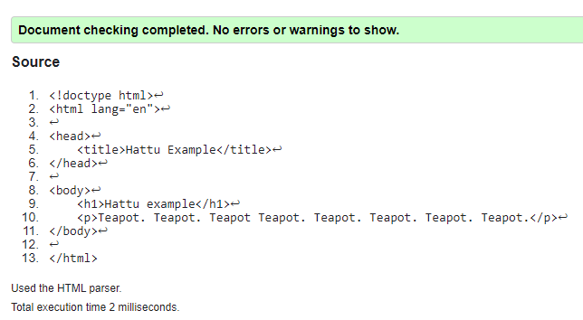

## Curl -komento

#### curl

Komento palauttaa webbisivun HTML-sisällön.

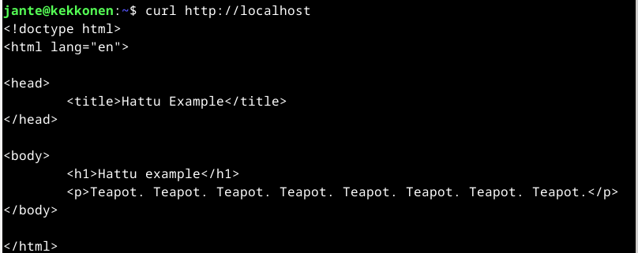

## GitHub Education

- Lähetetty hakemus Github Educationista 30.1.2024
- Hyväksytty hakemus 2.2.2024

##### Lähteet

Terokarvinen.com. Linux Palvelimet 2024 alkukevät. Luettavissa: https://terokarvinen.com/2024/linux-palvelimet-2024-alkukevat/ Luettu: 04.02.2024
