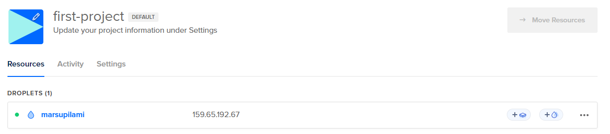

### Teoriasta käytäntöön pilvipalvelimen avulla

- Vuokrataan oma pilvipalvelin palveluntarjoajalta
- Lisäksi vuokrataan domainnimi
- Palomuurin asennus virtuaalikoneelle
- Apachen asennus ja etusivun muokkaus
- Lopuksi vielä ohjelmien päivitys

###### Lähde

Teoriasta käytäntöön pilvipalvelimen avulla (h4). Susannalehto.fi Luettavissa: https://susannalehto.fi/2022/teoriasta-kaytantoon-pilvipalvelimen-avulla-h4/ Luettu: 07.02.2024

### First Steps on a New Virtual Private Server – an Example on DigitalOcean and Ubuntu 16.04 LTS

- Tärkeää käyttää hyviä salasanoja.
- Eri palveluntarjoajia on monia ja kilpailu on kovaa

###### Lähde

First Steps on a New Virtual Private Server – an Example on DigitalOcean and Ubuntu 16.04 LTS. Terokarvinen.com. Luettavissa: https://terokarvinen.com/2017/first-steps-on-a-new-virtual-private-server-an-example-on-digitalocean/ Luettu: 07.02.2024

# Pilvipalvelimen vuokraus

Tehtävässä käytetään DigitalOcean palveluntarjoajaa pilvipalvelimen osalta ja NameCheap domainnimen palveluntarjoajana.

Aloitin luomalla tunnuksen DigitalOcean palveluun. Minulla on myös Github Education, jonka yhdistämällä DigitalOceaniin sai 200$ crediittiä.

Tunnuksen luotua "first-project" näkymästä klikkailin Getting started, josta valitsin luoda uuden virtual machinen.

Alueeksi on hyvä valita "asiakkaita" lähin oleva palvelinsali. Tässä tapauksessa se on Eurooppa ja valitsin Amsterdamin.

Imageksi Debian ja viimeisin versio. Tässä tapauksessa 12 x64.

Valitsin Shared CPU Basic planin, joka oli myös oletuksena. CPU options tarjosi oletuksena Premiumia mutta tähän projektiin riittää Regular, joten valitsin sen. Muutin myös hintaluokkaa toiseksi pienimpään.

Autentikointi metodina käytän salasanaa. 

En valitse mitään suositeltuja lisäpalveluita, joita tässä ehdotetaan.

Seuraavaksi nimetään palvelin. Nimen on hyvä olla jokin geneerinen, mikä ei paljasta koneesta mitään.

Minuutin odottelun jälkeen, virtuaalikone oli luotu ja sain koneen IP osoitteen.

### Vuokratulle virtuaalikoneelle kirjautuminen ja alkutoimet

Kirjaudun koneelle aikaisemmin kurssilla luodun Debianin kautta.

Terminaaliin komento

    ssh root@159.65192.67

Päivitin ensi koneen apt-get komennolla. Jonka jälkeen asensin tulimuurin.

    sudo apt-get update

    sudo apt-get dist-upgrade

    sudo apt-get install ufw

Tämän jälkeen avataan portti tulimuuriin SSH:lle. Jonka jälkeen enabloidaan tulimuuri.

    sudo ufw allow 22/tcp

    sudo ufw enable

Nyt virtuaalikone on suojattu palomuurilla.

Lisään tässä kohti vielä toisen portin avauksen tulimuurille tulevaa apache asennusta varten. (portti 80)

    sudo ufw allow 80/tcp

Voimme vielä tarkistaa muurin statuksen komennolla.

    sudo ufw status

### Käyttäjän lisäys palvelimelle

Uuden käyttäjän lisäys palvelimelle komennolla

    sudo adduser jante

Syötin hyvän salasanan ja kokonimen. Muut kohdat tyhjiksi. Sen jälkeen annoin käyttäjälle pääkäyttäjäoikeudet komennolla:

    sudo adduser jante sudo

Tämän jälkeen testataan, toimiiko tunnus. Avasin toisen terminal ikkunan ja koitan kirjautua äsken luodulla tunnuksella: ssh tunnus @ IP 

Testasin vielä apt-get update komentoa, joka toimi. Nyt kun tunnus on todettu toimivaksi, voidaan sulkea root -tunnus.

    sudo usermod –lock root

Sudon salasana lukittu. Muokataan vielä konffia, että disabloidaan rootilla kirjautuminen.

    sudoedit /etc/ssh/sshd_config

    # ...
    PermitRootLogin no
    # ...

    sudo service ssh restart

### Weppipalvelimen asennus

-
-

### Domainnimi

-
-
