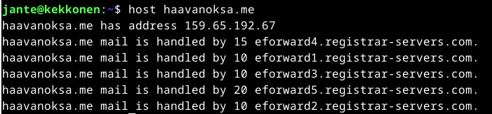
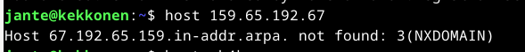
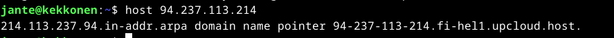
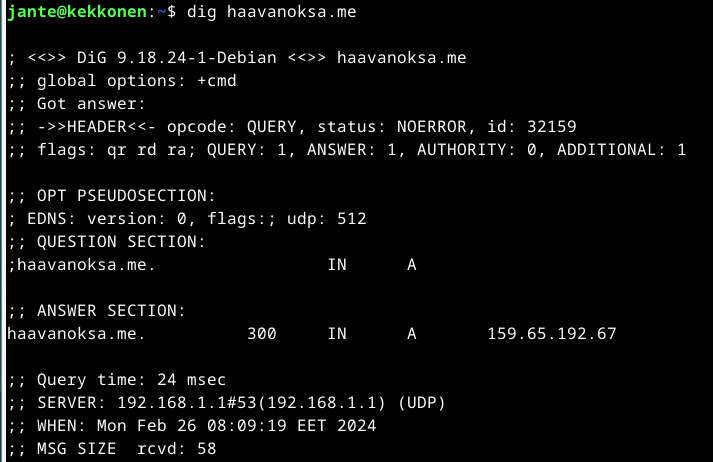
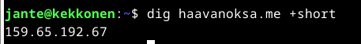

# Debianin ja Apachen asennus uudelleen

-
-
-

## Pubkey

-
-

## Digging host

Koitin ensin ajaa "host" komentoa ensimmäisellä asentamallani Linux koneella mutta sain ilmoituksen ettei kyseistä komentoa löydy.  
Lähdin etsimään tietoa netistä, kuinka saan asennettua tarvittavat paketit.

Löysin ohjeet nettisivulta https://webhostinggeeks.com/howto/how-to-fix-nslookup-host-dig-bash-command-not-found-in-linux/, jonka ohjeen mukaan tein:

Päivitin paketit:

    sudo apt-get update

Asensin paketit:

    sudo apt-get upgrade -y

Asensin DNS utilities -paketin:

    sudo apt-get install dnsutils

Tämän jälkeen kokeilin "host" -komentoa, ja se toimi.

### Host -komento

Host -komentoa käytetään DNS hakutoimintoihin.

Syntaksi:

    host [-aCdlriTWV] [-c class] [-N ndots] [-t type] [-W time]
         [-R number] [-m flag] hostname [server]

#### Esimerkkejä

host domainnimi tulostaa määritetyn toimialueen IP-osoitetiedot.

host IP-osoite näyttää määritetyn IP-osoitteen toimialueen tiedot.

Tässä kohtaa en osaa sanoa, miksi domain name pointer sanoo not found. Jos hakee muita nimiä, niin tuloksen pitäisi olla erilainen. Esimerkiksi:

-a tai -v parametreja käytetään määrittämään kyselytyyppi tai mahdollistamaan monisanaisen tulosteen.

-t parametrilla käytetään myös kyselytyypin määrittelyyn.

Kokeilin näitäkin komentoja mutta tarkoitus ei ehkä ihan vielä selvinnyt itselle.

### dig -komento

Dig-komento eli Domain Information Groper. Sitä käytetään DNS-nimipalvelimien tietojen hakemiseen. Sitä käyttävät periaatteessa verkonvalvojat. Sitä käytetään DNS-ongelmien tarkistamiseen ja vianetsintään sekä DNS-hakujen suorittamiseen. Dig-komento korvaa vanhemmat työkalut, kuten nslookup ja host.

Syntaksi:

    dig [server] [name] [type]

#### Esimerkkejä

dig domain

Tämä komento saa digin etsimään "A"-tietueen verkkotunnukselle "haavanoksa.me".

dig domain +short

Tämä lyhentää edellisen haun.

###### Lähteet

host command in Linux with examples. Geeksforgeeks.org. Luettavissa: https://www.geeksforgeeks.org/host-command-in-linux-with-examples/. Luettu: 25.2.2024.

How to Fix nslookup, host, dig: -bash: command not found in Linux? Webhostinggeeks.com. Luettavissa: https://webhostinggeeks.com/howto/how-to-fix-nslookup-host-dig-bash-command-not-found-in-linux/. Luettu: 25.2.2024.

Linux Palvelimet 2024 alkukevät. Terokarvinen.com. Luettavissa: https://terokarvinen.com/2024/linux-palvelimet-2024-alkukevat/. Luettu: 25.2.2024.
