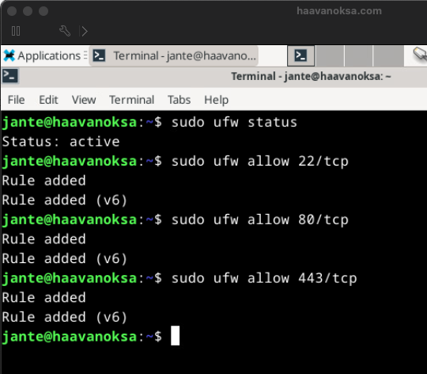
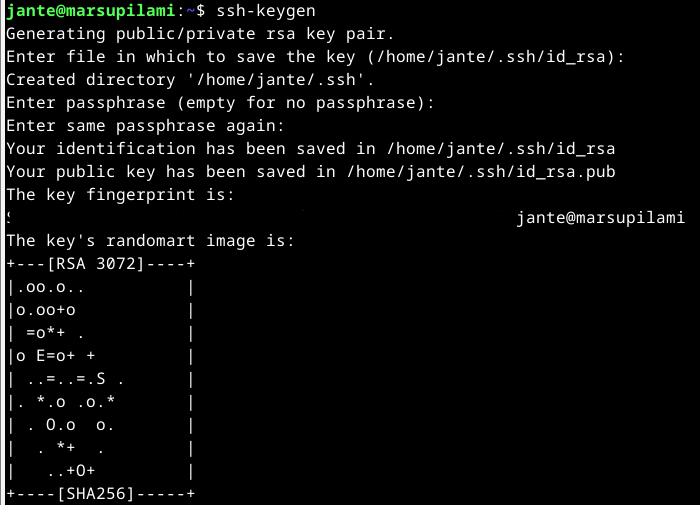
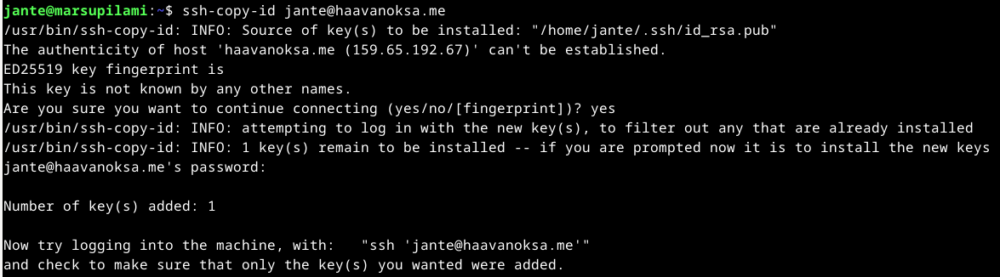

# Debianin ja Apachen asennus uudelleen

Asensin Debian virtual Linuxin vSpeheren hallinnassa VMwareen. Ostin myös domainin haavanoksa.com, jonka asetin osoittamaan tähän koneeseen. Tähän asennukseen käytin toista tietokonettani Macbook Pro intel based 2018. Palvelin koneena toimii dell-r730

Aloitin luomalla ensin uuden virtuaalikoneen. Tästä avautui wizardi, jossa tämä määriteltiin.

Annoin koneen nimeksi haavanoksa.com

Palvelimella on valmiiksi minulle luotu kansio virtuaalikoneille

Datastoragen valinta

Käyttöjärjestelmäksi Linux Debian x64

Muita muutoksia en tehnyt kuin valitsin internetin suoraan julkiseksi

Yhteenvetona vielä speksit

Tämän jälkeen hain Debianin iso imagen https://cdimage.debian.org/debian-cd/current-live/amd64/iso-hybrid/

Avasin koneeltani terminaalin, menin lataukset kansioon ja ajoin komennon joka siirtää iso imagen vspereen

    scp debian-live-12.5.0-amd64-xfce.iso tunnus@kone.tld:/vmfs/volumes/datastore/ISO

Asetin ISO imagen koneeseen valitsemalla edit settings ja valitsemalla CD asemaan Datastorage Iso File

Koneen käynnistys startti nappulasta ja remote consolen avaus. Tässä kohtaa asensin App Storesta VMware remote console appin, jolla sain etätyöpöytä yhteyden koneeseen.

Sain työpöytänäkymän käyntiin, ja nyt asentamaan Debian työpöydällä olevan kuvakkeen kautta samaan tapaan kuin ensimmäisessä VirtualBox Linux asennuksessa.

Asennuksen jälkeen koneelle kirjautuminen

Verkkoasetusten muokkaus kiinteäksi komennolla

    sudo nmtui

Verkkoasetusten uudelleen käynnistys

    sudo /etc/init.d/networking restart

Jotta lähti toimintaan niin vielä nmtuista deactivate/activate. Tämän jälkeen pakettien päivitys toimi.

    sudo apt-get update

Tulimuurin asennus

    sudo apt-get -y install ufw
    sudo ufw enable

Porttien avaus ssh, http ja https :lle 

Sitten voidaan sulkea sudo tunnuksella kirjautuminen

    sudo usermod --lock root

Koitin estää sudon ssh kirjautumisen mutta konffi tiedostoa ei löytynyt. Asentamaan siis SSH server. https://linuxgenie.net/how-to-configure-and-enable-ssh-on-debian-12/

    sudo apt install openssh-server

    sudo systemctl start ssh

    sudo systemctl status ssh

SSH toiminnassa. Nyt Konffi tiedosto löytyi, ja muutettu:

    sudoedit /etc/ssh/sshd_config

    # ...
    PermitRootLogin no
    # ...

    sudo service ssh restart

SSH:n testaus omalta Mac koneelta. Todettu toimivaksi.

Näytön resoluution muutos asentamalla vm toolsit

    sudo apt install open-vm-tools

### Apachen asennus

-
-
-

##### Seuraavat tehtävät on tehty taas Windows koneellani VirtualBox ympäristössä

## Pubkey

Kirjautumisen aktivointi julkisella SSH -avaimella.

Asensin tämän DigitalOceanissa olevaan virtuaalikoneeseen; Debian Linuxiin.

Avaimen luonti komennolla

    ssh-keygen

Tallensin avaimen oletussijaintiin.

Avaimen kopiointi komennolla

    ssh-copy-id jante@haavanoksa.me

Seuraavaksi testaan kirjautumista käytännössä. Lopetan yhteyden "exit" komennolla. Kokeilen kirjautua uudelleen ssh:lla.

    ssh jante@haavanoksa.me

Jostakin syystä yhteys kysyy kuitenkin salasanaa. Kokeilin vielä generoida ja kopioida avaimen uudelleen mutta en saanut tätä toimimaan.

## Digging host

Koitin ensin ajaa "host" komentoa ensimmäisellä asentamallani Linux koneella mutta sain ilmoituksen ettei kyseistä komentoa löydy.  
Lähdin etsimään tietoa netistä, kuinka saan asennettua tarvittavat paketit.

Löysin ohjeet nettisivulta https://webhostinggeeks.com/howto/how-to-fix-nslookup-host-dig-bash-command-not-found-in-linux/, jonka ohjeen mukaan tein:

Päivitin paketit:

    sudo apt-get update

Asensin paketit:

    sudo apt-get upgrade -y

Asensin DNS utilities -paketin:

    sudo apt-get install dnsutils

Tämän jälkeen kokeilin "host" -komentoa, ja se toimi.

### Host -komento

Host -komentoa käytetään DNS hakutoimintoihin.

Syntaksi:

    host [-aCdlriTWV] [-c class] [-N ndots] [-t type] [-W time]
         [-R number] [-m flag] hostname [server]

#### Esimerkkejä

host domainnimi tulostaa määritetyn toimialueen IP-osoitetiedot.

host IP-osoite näyttää määritetyn IP-osoitteen toimialueen tiedot.

Tässä kohtaa en osaa sanoa, miksi domain name pointer sanoo not found. Jos hakee muita nimiä, niin tuloksen pitäisi olla erilainen. Esimerkiksi:

-a tai -v parametreja käytetään määrittämään kyselytyyppi tai mahdollistamaan monisanaisen tulosteen.

-t parametrilla käytetään myös kyselytyypin määrittelyyn.

Kokeilin näitäkin komentoja mutta tarkoitus ei ehkä ihan vielä selvinnyt itselle.

### dig -komento

Dig-komento eli Domain Information Groper. Sitä käytetään DNS-nimipalvelimien tietojen hakemiseen. Sitä käyttävät periaatteessa verkonvalvojat. Sitä käytetään DNS-ongelmien tarkistamiseen ja vianetsintään sekä DNS-hakujen suorittamiseen. Dig-komento korvaa vanhemmat työkalut, kuten nslookup ja host.

Syntaksi:

    dig [server] [name] [type]

#### Esimerkkejä

dig domain

Tämä komento saa digin etsimään "A"-tietueen verkkotunnukselle "haavanoksa.me".

dig domain +short

Tämä lyhentää edellisen haun.

###### Lähteet

Debian Live image luettavissa: https://cdimage.debian.org/debian-cd/current-live/amd64/iso-hybrid/. Luettu 26.2.2024.

dig Command in Linux with Examples. Geeksforgeeks.org. Luettavissa: https://www.geeksforgeeks.org/dig-command-in-linux-with-examples/. Luettu: 26.2.2024.

host command in Linux with examples. Geeksforgeeks.org. Luettavissa: https://www.geeksforgeeks.org/host-command-in-linux-with-examples/. Luettu: 25.2.2024.

How to Configure and Enable SSH on Debian 12. Linuxgenie.net. Luettavissa: https://linuxgenie.net/how-to-configure-and-enable-ssh-on-debian-12/. Luettu: 26.2.2024.

How To Configure SSH Key-Based Authentication on a Linux Server. Digitalocean.com. Luettavissa: https://www.digitalocean.com/community/tutorials/how-to-configure-ssh-key-based-authentication-on-a-linux-server. Luettu 26.2.2024.

How to Fix nslookup, host, dig: -bash: command not found in Linux? Webhostinggeeks.com. Luettavissa: https://webhostinggeeks.com/howto/how-to-fix-nslookup-host-dig-bash-command-not-found-in-linux/. Luettu: 25.2.2024.

Linux Palvelimet 2024 alkukevät. Terokarvinen.com. Luettavissa: https://terokarvinen.com/2024/linux-palvelimet-2024-alkukevat/. Luettu: 25.2.2024.
