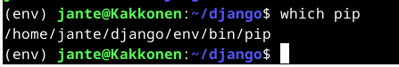

### Tiivistelmä artikkeleista

- Virtual enviromentin asennus
- Uuden virtual envin asennus pythonin kanssa
- Pipin käyttö virtual envin kanssa
- Djangon asennus
- Django projektin luonti ja käynnistys
- Tuotantoasennuksessa käytetään mod_wsgitä yhdistämään python ja apache

###### Lähteet

- Karvinen 2021: Django 4 Instant Customer Database Tutorial. Luettavissa: https://terokarvinen.com/2022/django-instant-crm-tutorial/. Luettu: 1.3.2024.
- Karvinen 2021: Deploy Django 4 - Production Install. Luettavissa: https://terokarvinen.com/2022/deploy-django/. Luettu: 1.3.2024.

# Django testiasennus

Tein ensin kotihakemistooni "django" nimisen kansion, johon teen seuraavat asennukset.

Virtual envin asennus

    sudo apt-get install virtualenv -y

Luon uuden virtualenvin ja lataan sinne viimeisimmän version pythonista

    virtualenv --system-site-packages -p python3 env/

Tämä luo uuden kansion env/, jossa on uusimmat paketit tiedostossa lib/site-packages/.

Nyt voidaan käyttää virtual enviä komennolla

    source env/bin/activate

Komentokehotteeseen pitäisi nyt ilmestyä (env) eteen.

Seuraavaksi käytetään pip:iä asennuksissa. Pippiä ei tule käyttää ilman virtual enviä eikä sudon kanssa.

Luodaan django kansioon tiedosto requirements.txt, johon kirjoitetaan "django". (tässä on tärkeää varmistaa, että django on kirjoitettu oikein)

Sitten asennetaan pipillä django käyttäen juuri luotua tekstitiedostoa

    pip install -r requirements.txt

Tarkistus vielä komennolla, joka kertoo meille djangon versionumeron

    django-admin --version

### Django projektin luonti

Luodaan projekti nimeltä "jahaa" (Tämä on testi projekti eikä julkiseen internettiin koskaan julkaistava)

    django-admin startproject jahaa

Mennään juuri luotuun projektikansioon, josta se käynnistetään

    cd jahaa

Käynnistys komennolla

    ./manage.py runserver

Projekti on nyt käynnissä local osoitteessa http://127.0.0.1:8000

Sivun pitäisi nyt näyttää tältä

### Admin interface

(projekti ei ole käynnissä seuraavien toimenpiteiden aikana)

Tietokannan päivitys

    ./manage.py makemigrations
    ./manage.py migrate

Lataan ensin salasana generaattorin, jolla luon salasanan uudelle käyttäjälle

    sudo apt-get install pwgen
    pwgen -s 20 1 # randomize a password

Käyttäjän lisäys

    ./manage.py createsuperuser

Täytän pyydetyt tiedot, ja käyttäjä on nyt luotu.

Projektin käynnistys takaisin päälle

    ./manage.py runserver

Nyt voimme kokeilla kirjautua osoitteeseen http://127.0.0.1:8000/admin/

Lisätään vielä peruskäyttäjä admin paneelin kautta, ja kokeillaan kirjautua sillä sisään. Käyttäjälle lisätty "staff" oikeudet, ja "view" ja "add" oikeudet. 

Kirjautuminen testattu ja todettu onnistuneeksi.

### Customer Database

(projekti ei ole käynnissä seuraavien toimenpiteiden aikana)

Luodaan uusi kansio "crm" sovelluksellemme

    ./manage.py startapp crm

Lisätään sovellus listaan

    micro jahaa/settings.py

Asetus tiedostossa lisätään siis 'crm' listaan kuvan mukaisesti

Lisätään muutama malli. Django voi luoda malleista automaattisesti tietokantoja, järjestelmänvalvojan näkymiä tai jopa lomakkeita.

    micro crm/models.py

Lisätään tähän:

    from django.db import models

    class Customer(models.Model):
       name = models.CharField(max_length=300)

Asiakasluokka luo tietokantaan "asiakas" -taulukon "nimi"-sarakkeella.

    ./manage.py makemigrations
    ./manage.py migrate

Nähdäksemme uuden tietokantaamme admin/-sivulla, meidän on rekisteröitävä se

    micro crm/admin.py

Tähän tiedostoon:

    from django.contrib import admin
    from . import models
    
    admin.site.register(models.Customer)

Projektin käynnistys

    ./manage.py runserver

Sivulla pitäisi nyt näkyä CRM valikko

Lisätään muutama asiakas "Customers" alle. Lista näyttää nyt "Customer object" listassa mutta muokataan crm/models.py tiedostoa siten, että saadaan listaan näkyviin asiakkaiden nimet.

(projekti ei ole käynnissä seuraavien toimenpiteiden aikana)

    micro crm/models.py

Lisätään tiedostoon

    def __str__(self):
        return self.name

Tiedosto näyttää nyt tältä:

Projekti käyntiin ja testaus admin sivulla

# Django tuotannossa

Lataan ensin Apache2:sen virtuaalikoneelleni

    sudo apt-get install apache2 -y

Testaan asennuksen toimivaksi menemällä selaimessa localhost osoitteeseen

Korvataan testisivu yksinkertaisemmalla sivulla:

    echo "To Be Done Webpage"|sudo tee /var/www/html/index.html

Localhost sivun päivitys, ja tarkistus, että nähdään asetettu lause.

Luodaan nyt kotihakemistoon kansio

    mkdir -p publicwsgi/jantehaa/static/

Tänne luodaan index.html esimerkkisisällöllä

    echo "Statically TBD Webpage"|tee publicwsgi/jantehaa/static/index.html

Luodaan uusi VirtualHost sudolla

    sudoedit /etc/apache2/sites-available/jantehaa.conf

Kirjoitetaan tiedostoon konffi:

    <VirtualHost *:80>
    	Alias /static/ /home/jante/publicwsgi/jantehaa/static/
    	<Directory /home/jante/publicwsgi/jantehaa/static/>
    		Require all granted
    	</Directory>
    </VirtualHost>

Aktivoidaan jantehaa.conf ja disabloidaan oletus konffi

    sudo a2ensite jantehaa.conf
    sudo a2dissite 000-default.conf 

Tarkistetaan vielä, että konffi toimii

    /sbin/apache2ctl configtest

Syntax ok ja apachen uudelleen käynnistys

    sudo systemctl restart apache2

Katsotaan selaimessa osoite http://localhost/static/

Sivulla näkyy nyt oikea sisältö, joka luotiin kotihakemistoon.

### VirtualEnv & Django

Navigoidaan publicwsgi/ kansioon

Asennetaan tänne uusi VirtualEnv ja python

    virtualenv -p python3 --system-site-packages env

Käynnisteään Virtuaaliympäristö

    source env/bin/activate

Kehotteessa on nyt teksti "(env)". Virtualenv:n lopetus komennolla: 'deactivate'. Virtualenv vain auttaa meitä pitämään pakettimme hyvässä kunnossa, se ei tarjoa turvallisuusetuja. Jokainen asennettu paketti on harkittava erikseen, joten se on vähemmän turvallinen kuin apt-get.

Varmuuden vuoksi tarkistetaan, että paketin asennusohjelman pip on env/-hakemistosta.

Luodaan taas tekstitiedosto requirements.txt, jossa teksti "django"

    micro requirements.txt

Sitten asennus

    pip install -r requirements.txt

Version tarkistus

    django-admin --version

Django ladattu onnistuneesti pipin avulla, joten seuraavaksi uusi projekti

Luodaan projekti nimeltä jante

    django-admin startproject jante

Yhdistetään Python Apacheen käyttäen mod_wsgi

Jotta Apache voidaan määrittää palvelemaan Python-ohjelmia, mukaan lukien Django, meidän on tiedettävä kolme absoluuttista polkua:

- Django projektin main-kansio, jossa manage.py "/home/jante/publicwsgi/jante/" (TDIR)
- Polku wsgi.py:lle "/home/jante/publicwsgi/jante/jante/wsgi.py" (TWSGI)
- Virtualenv site-packages kirjasto "/home/jante/publicwsgi/env/lib/python3.11/site-packages" (TVENV)

Muokataan nämä polut konffi tiedostoon. Konffi tiedosto kopioitu suoraan terokarvinen.com ohjeesta (https://terokarvinen.com/2022/deploy-django/?fromSearch=django)

    sudoedit /etc/apache2/sites-available/jantehaa.conf

Asennetaan Apache WSGI -moduuli, jotta Apache oppii, mitä WSGI-komennot tarkoittavat.

    sudo apt-get -y install libapache2-mod-wsgi-py3

Syntaxin tarkistus

    /sbin/apache2ctl configtest

Syntax ok, ja apachen potkaisu

    sudo systemctl restart apache2

Asennuksen tarkistus

    curl -s localhost | grep title

localhostilla näkyy nyt django oletussivu.

Tarkistetaan vielä, että webserveri on oikeasti Apachella pyörimässä eikä development ympäristössä

    curl -sI localhost | grep Server

Jee, se on Apache.

Seuraavaksi disabloidaan DEBUG ja kerrotaan Djangolle, mikä sivu se on.

    cd publicwsgi/jante/
    micro jante/settings.py

Muokataan asetustiedostoa seuraavasti

    DEBUG = False
    ALLOWED_HOSTS = ["localhost", "haavanoksa.me"]

Ladataan muutokset

    touch teroco/wsgi.py

Jotkut muutokset saattavat vaatia apachen uudelleen käynnistyksen

    sudo systemctl restart apache2

Nyt localhost antaa sivun 404, sillä sisältöä ei ole määritetty

Osoite http://localhost/admin tarjoilee kuitenkin admin portaalin mutta ilman css tyylejä. Korjataan tämä seuraavaksi.

    micro jante/settings.py

Lisätään tiedostoon:

    import os
    STATIC_ROOT = os.path.join(BASE_DIR, 'static/')

Seuraavaksi:

    ./manage.py collectstatic

Nyt admin sivu näyttää paremmalta:

Luodaan nyt käyttäjä

    python manage.py migrate

    python manage.py createsuperuser

Kirjaudutaan tunnuksella admin paneeliin.

###### Lähteet

Deploy Django 4 - Production Install. Terokarvinen.com. Luettavissa: https://terokarvinen.com/2022/deploy-django/?fromSearch=django. Luettu: 1.3.2024.

Django 4 Instant Customer Database Tutorial. Terokarvinen.com. Luettavissa: https://terokarvinen.com/2022/django-instant-crm-tutorial/. Luettu: 1.3.2024.

Linux Palvelimet 2024 alkukevät. Terokarvinen.com. Luettavissa: https://terokarvinen.com/2024/linux-palvelimet-2024-alkukevat/. Luettu: 1.3.2024.
