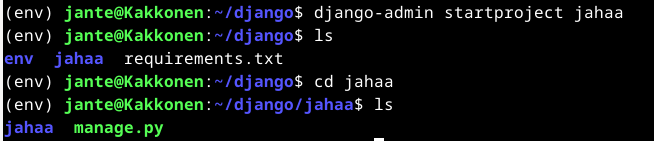

### Tiivistelmä artikkeleista

- Virtual enviromentin asennus
- Uuden virtual envin asennus pythonin kanssa
- Pipin käyttö virtual envin kanssa
- Djangon asennus
- Django projektin luonti ja käynnistys
- Tuotantoasennuksessa käytetään mod_wsgitä yhdistämään python ja apache

###### Lähteet

- Karvinen 2021: Django 4 Instant Customer Database Tutorial. Luettavissa: https://terokarvinen.com/2022/django-instant-crm-tutorial/. Luettu: 1.3.2024.
- Karvinen 2021: Deploy Django 4 - Production Install. Luettavissa: https://terokarvinen.com/2022/deploy-django/. Luettu: 1.3.2024.

## Django testiasennus

Tein ensin kotihakemistooni "django" nimisen kansion, johon teen seuraavat asennukset.

Virtual envin asennus

    sudo apt-get install virtualenv -y

Luon uuden virtualenvin ja lataan sinne viimeisimmän version pythonista

    virtualenv --system-site-packages -p python3 env/

Tämä luo uuden kansion env/, jossa on uusimmat paketit tiedostossa lib/site-packages/.

Nyt voidaan käyttää virtual enviä komennolla

    source env/bin/activate

Komentokehotteeseen pitäisi nyt ilmestyä (env) eteen.

Seuraavaksi käytetään pip:iä asennuksissa. Pippiä ei tule käyttää ilman virtual enviä eikä sudon kanssa.

Luodaan django kansioon tiedosto requirements.txt, johon kirjoitetaan "django". (tässä on tärkeää varmistaa, että django on kirjoitettu oikein)

Sitten asennetaan pipillä django käyttäen juuri luotua tekstitiedostoa

    pip install -r requirements.txt

Tarkistus vielä komennolla, joka kertoo meille djangon versionumeron

    django-admin --version

### Django projektin luonti

Luodaan projekti nimeltä "jahaa" (Tämä on testi projekti eikä julkiseen internettiin koskaan julkaistava)

    django-admin startproject jahaa

Mennään juuri luotuun projektikansioon, josta se käynnistetään

    cd jahaa

Käynnistys komennolla

    ./manage.py runserver

Projekti on nyt käynnissä local osoitteessa http://127.0.0.1:8000

Sivun pitäisi nyt näyttää tältä

### Admin interface

(projekti ei ole käynnissä seuraavien toimenpiteiden aikana)

Tietokannan päivitys

    ./manage.py makemigrations
    ./manage.py migrate

Lataan ensin salasana generaattorin, jolla luon salasanan uudelle käyttäjälle

    sudo apt-get install pwgen
    pwgen -s 20 1 # randomize a password

Käyttäjän lisäys

    ./manage.py createsuperuser

Täytän pyydetyt tiedot, ja käyttäjä on nyt luotu.

Projektin käynnistys takaisin päälle

    ./manage.py runserver

Nyt voimme kokeilla kirjautua osoitteeseen http://127.0.0.1:8000/admin/

Lisätään vielä peruskäyttäjä admin paneelin kautta, ja kokeillaan kirjautua sillä sisään. Käyttäjälle lisätty "staff" oikeudet, ja "view" ja "add" oikeudet. 

Kirjautuminen testattu ja todettu onnistuneeksi.

### Customer Database

(projekti ei ole käynnissä seuraavien toimenpiteiden aikana)

Luodaan uusi kansio "crm" sovelluksellemme

    ./manage.py startapp crm

Lisätään sovellus listaan

    micro jahaa/settings.py

Asetus tiedostossa lisätään siis 'crm' listaan kuvan mukaisesti

Lisätään muutama malli. Django voi luoda malleista automaattisesti tietokantoja, järjestelmänvalvojan näkymiä tai jopa lomakkeita.

    micro crm/models.py

Lisätään tähän:

    from django.db import models

    class Customer(models.Model):
       name = models.CharField(max_length=300)

Asiakasluokka luo tietokantaan "asiakas" -taulukon "nimi"-sarakkeella.

    ./manage.py makemigrations
    ./manage.py migrate

Nähdäksemme uuden tietokantaamme admin/-sivulla, meidän on rekisteröitävä se

    micro crm/admin.py

Tähän tiedostoon:

    from django.contrib import admin
    from . import models
    
    admin.site.register(models.Customer)

Projektin käynnistys

    ./manage.py runserver

Sivulla pitäisi nyt näkyä CRM valikko

Lisätään muutama asiakas "Customers" alle. Lista näyttää nyt "Customer object" listassa mutta muokataan crm/models.py tiedostoa siten, että saadaan listaan näkyviin asiakkaiden nimet.

(projekti ei ole käynnissä seuraavien toimenpiteiden aikana)

    micro crm/models.py

Lisätään tiedostoon

    def __str__(self):
        return self.name

Tiedosto näyttää nyt tältä:

Projekti käyntiin ja testaus admin sivulla

## Django tuotannossa

###### Lähteet

Deploy Django 4 - Production Install. Terokarvinen.com. Luettavissa: https://terokarvinen.com/2022/deploy-django/?fromSearch=django. Luettu: 1.3.2024.

Django 4 Instant Customer Database Tutorial. Terokarvinen.com. Luettavissa: https://terokarvinen.com/2022/django-instant-crm-tutorial/. Luettu: 1.3.2024.

Linux Palvelimet 2024 alkukevät. Terokarvinen.com. Luettavissa: https://terokarvinen.com/2024/linux-palvelimet-2024-alkukevat/. Luettu: 1.3.2024.
