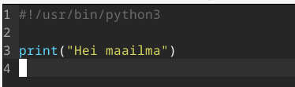
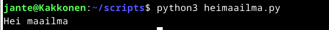
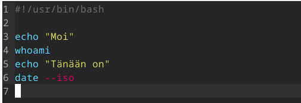
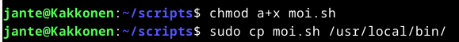
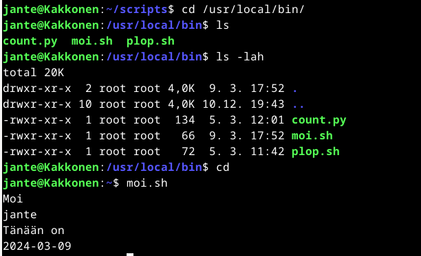

# Hei maailma

Loin kotihakemistooni kansion scripts, jonne loin uuden ajettavan skriptin python kielellä.

Ensin loin skriptitiedoston kansioon:

    micro heimaailma.py

Tiedoston alkuun määrittelen, millä kielellä se ajetaan: #!/usr/bin/python3

Ja seuraavaksi itse koodi:

    print("Hei maailma")

Seuraavaksi testasin komentoa:

    python3 heimaailma.py

# Komennot kaikkien ajettavaksi

Seuraavaksi tein uuden komennon bash kielellä, jonka asetin kaikkien käyttäjien ajettavaksi.

Ensin loin tiedoston:

    micro moi.sh

Määrittelin tiedoston alkuun, että se on tällä kertaa bash kielellä ajettava komento: #!/usr/bin/bash

Seuraavaksi kirjoitin tiedostoon sisältöä, joka tervehtii käyttäjää ja kertoo päivän.

Seuraavaksi annoin execute oikeudet kaikille käyttäjille:

    chmod a+x moi.sh

Ja kopioin tiedoston lokaaliin kansioon:

    sudo cp moi.sh /usr/local/bin/

Seuraavaksi navigoin lookaaliin kansioon tarkistamaan, että tiedosto on siellä. Tarkistin myös, että execute oikeus löytyy kaikilta. Tämän jälkeen testasin vielä komentoa kotikansiosta.

# Arvioitavan tehtävän harjoitus

-
-
-

# Tyhjän Linuxin asentaminen lopputehtävää varten

Aloitin luomalla VirtualBoxiin uuden linuxin arvioitavaa labratehtävää varten. Hain netistä uuden iso-imagen: Debian 12, codenamed bookworm, netinst, for 64-bit PC (amd64) (https://www.debian.org/download)

Nimesin koneen Labrakoneeksi, muistia 4000MB, kiintolevy 50GB ja iso-imageksi juuri ladattu tiedosto. Type Linux ja versio Debian 64bit.

Tämän jälkeen starttasin koneen

###### Lähteet

Downloading Debian. Debian.orf. Luettavissa: https://www.debian.org/download. Luettu: 9.3.2024.

How to Make Script Executable in Linux | chmod Command. Geeksforgeeks.org. Luettavissa: https://www.geeksforgeeks.org/chmod-command-linux/. Luettu: 9.3.2024.

Linux Palvelimet 2024 alkukevät. Terokarvinen.com. Luettavissa: https://terokarvinen.com/2024/linux-palvelimet-2024-alkukevat/. Luettu: 9.3.2024.

